# Copilot Recommendation: Add a GitHub Feature to TenantCompass with Spec-Kit Studio

## Purpose

This document defines a rigorous way to take a feature described or implemented on GitHub, turn it into an auditable specification in Spec-Kit Studio, and implement it safely in the `cloud-asset-inventory` repository with GitHub Copilot.

The goal is not to make an AI generate more code. The goal is to create a controlled evidence chain:

```text
GitHub source evidence
  -> reviewed feature specification
  -> repository-aligned architecture plan
  -> requirement-linked implementation tasks
  -> bounded Copilot coding sessions
  -> executable verification
  -> reviewable pull request
  -> production evidence and specification closure
```

For TenantCompass, this matters because a seemingly small feature can cross a React SPA, two Flask APIs, DynamoDB access patterns, Redis, ECS jobs, Lambda triggers, Terraform, and selective GitHub Actions workflows. The feature must fit the existing system; the system must not be reshaped around an AI-generated guess.

## Executive Recommendation

Use Spec-Kit Studio as the **feature control plane**, GitHub as the **source and review system**, GitHub Copilot as the **bounded implementation agent**, and TenantCompass tests and CI as the **source of verification truth**.

Adopt these five rules:

1. Treat GitHub content as source evidence, not as an implementation order.
2. Create a separate Spec-Kit project for the feature, then reconcile it with TenantCompass. Do not use blind merge for a complex feature.
3. Require repository evidence for every architecture decision: existing files, APIs, DynamoDB keys, Terraform resources, tests, or documented conventions.
4. Give Copilot one independently verifiable task at a time, including exact files, constraints, and a test command.
5. Never equate an AI audit score with readiness. Readiness requires deterministic checks: traceability, tests, builds, security review, and Terraform plan where applicable.

The ideal workflow is:

```mermaid
flowchart LR
    A[GitHub issue, PR, or reference feature] --> B[Evidence packet]
    B --> C[Spec-Kit feature workspace]
    C --> D[Human specification gate]
    D --> E[Architecture and data-access gate]
    E --> F[Requirement-linked task DAG]
    F --> G[One-task Copilot session]
    G --> H[Focused executable check]
    H -->|fail| G
    H -->|pass| I[PR and CI gates]
    I --> J[Deploy and observe]
    J --> K[Close spec with evidence]
```



## 1. What “Take a Feature from GitHub” Can Mean

Resolve the source type before importing anything. Each type carries different evidence and risks.

| Source type | Useful evidence | Primary risk | Recommended treatment |
|---|---|---|---|
| GitHub issue | Problem, users, acceptance criteria, discussion | Requirements may be incomplete or contradictory | Import issue body and approved clarifications; mark unresolved comments explicitly |
| GitHub pull request | Behavior, code diff, tests, review discussion | Code may be tightly coupled to another architecture | Extract observable behavior and contracts, not the patch structure |
| Feature in another repository | Running behavior, APIs, schemas, UX | License, provenance, dependency, and architecture mismatch | Re-specify behavior for TenantCompass; do not copy code until license and fit are reviewed |
| GitHub discussion or design document | Alternatives and intent | May not represent an approved decision | Record as context; require an owner and approval state |
| Existing TenantCompass issue | Local intent and links to current code | Hidden cross-service impact | Add repository impact analysis and explicit non-functional requirements |

For third-party code, complete a license and provenance review before copying code, images, data, tests, or documentation. The safe default is to adopt the behavior and design constraints, then implement them using TenantCompass patterns.

## 2. Current Spec-Kit Studio Capability: Verified Reality

The following assessment is based on the current implementation, not only the README.

### 2.1 What works today

| Capability | Current behavior | How it helps |
|---|---|---|
| Feature text/file import | Sends pasted text or an uploaded text document to `/api/feature/import` for structured extraction | Converts issue prose into stories, requirements, tasks, and candidate rules |
| GitHub repository listing | `/api/github/repos` uses a GitHub token to list repositories | Lets a user select a publication target |
| GitHub issue listing API | `/api/github/issues` fetches open repository issues | Provides a backend primitive for issue selection, although it is not wired into Feature Import |
| Repository analysis | `/api/repo/analyze` asks Gemini to infer a stack from a URL, manifest, or supplied file payload | Useful when real manifests and file evidence are pasted or supplied |
| Feature specification | Structured stories, functional and non-functional requirements, user flows, edge cases, and success metrics | Creates a reviewable product contract |
| Architecture plan | Captures stack choices, components, API contracts, generic schemas, ADRs, and Mermaid diagrams | Makes technical decisions visible before coding |
| Phased tasks | Captures status, dependencies, estimates, requirement mapping, and per-task prompt snippets | Supports small Copilot work units and traceability |
| Constitution | Captures mandatory, recommended, and optional governance rules | Carries target-repository constraints into prompts |
| AI audit | Scores completeness, clarity, testability, and traceability and returns gaps | Useful as a critique pass before deterministic gates |
| Prompt Studio | Compiles constitution, requirements, stack, one selected task, and custom notes | Produces a bounded starting prompt for an agent |
| ZIP export | Exports `spec.md`, `plan.md`, `tasks.md`, `constitution.md`, metadata, prompts, and a helper script | Creates versionable artifacts |
| GitHub publication | `/api/github/commit-spec` writes files under `.spec-kit/` on a selected branch | Publishes specification artifacts to the target repository |
| Jira integration | Lists projects/issues and creates an issue through server routes | Can project approved stories into delivery tracking |
| Local persistence | Stores projects and integration settings in browser `localStorage` | Supports quick local editing and multiple workspaces |

Key implementation references:

- Feature import: [FeatureImportModal.tsx](../src/components/import/FeatureImportModal.tsx)
- Repository analysis: [RepoImportStudio.tsx](../src/components/import/RepoImportStudio.tsx)
- Prompt compilation: [PromptStudio.tsx](../src/components/prompt/PromptStudio.tsx)
- Export behavior: [export.ts](../src/lib/export.ts)
- API integrations: [server.ts](../server.ts)
- Project schema: [speckit.ts](../src/types/speckit.ts)
- Local integration storage: [integrationsStore.ts](../src/lib/integrationsStore.ts)

### 2.2 Important limitations

These limitations change how the tool should be used.

1. **The Feature Import GitHub tab does not fetch the URL.** Entering a URL changes the input to `Feature from GitHub Issue: <url>`. The issue body must still be pasted manually. The existing `/api/github/issues` endpoint is not connected to this modal.
2. **A repository URL is not repository introspection.** `/api/repo/analyze` gives the URL string to Gemini; it does not clone the repository or fetch its tree and files. High-confidence analysis requires supplied manifests, file trees, and architecture documents.
3. **Merge is partial.** “Merge into active project” appends user stories, functional requirements, and tasks. It does not merge non-functional requirements, architecture plan changes, API contracts, data schemas, ADRs, or constitution rules. IDs can also collide.
4. **Generated defaults can be wrong for TenantCompass.** Feature creation can default to React/Tailwind and Express/TypeScript. Prompt Studio always includes “Write ... TypeScript code,” even when the selected task is Python or Terraform.
5. **The schema model is generic.** `DataSchema` has fields, types, and required flags, but no first-class partition key, sort key, GSI, stream, TTL, encryption, PITR, or access-pattern concepts.
6. **The audit is advisory.** It is an LLM judgment, and the UI shows a default high score before a real audit. It does not execute tests, inspect code, validate OpenAPI, detect `Scan`, run Terraform, or prove traceability.
7. **Export validation is illustrative.** The generated `specify.sh check` prints a success message; it does not validate artifacts.
8. **GitHub publication writes files individually.** A partial update is possible if a later file fails. It updates the selected branch directly and does not create a branch or pull request transaction.
9. **ZIP import preserves markdown more reliably than structured data.** Imported markdown is retained, but stories, requirements, schemas, and tasks are not fully reconstructed into editable structured objects.
10. **Secrets are stored in browser localStorage.** GitHub PAT and Jira API credentials are exposed to any successful same-origin script injection and persist until removed.
11. **Project data is localStorage-only.** Browser cleanup, profile changes, or storage corruption can remove the active planning record.
12. **No test script exists in Spec-Kit Studio.** The current deterministic application checks are TypeScript lint/type checking and production build.

### 2.3 Safe operating interpretation

| Studio output | Treat as | Do not treat as |
|---|---|---|
| AI-extracted requirement | Draft requiring owner review | Approved requirement |
| Repository analysis from URL only | Low-confidence hypothesis | Codebase fact |
| Architecture plan | Proposed design | Existing implementation truth |
| Audit score | Review aid | Release gate |
| Generated prompt | Task briefing draft | Permission for broad changes |
| ZIP or GitHub export | Versioned planning artifact | Proof of implementation |
| Completed task checkbox | Workflow status | Proof that acceptance criteria pass |

## 3. Why Spec-Kit Studio Is Valuable for TenantCompass

TenantCompass is a strong candidate for specification-driven feature delivery because it has many architectural invariants:

- React SPA clients must use backend REST APIs and never access DynamoDB directly.
- Inventory and Attestation are separate Flask applications with versioned blueprints.
- Authorization is based on Azure AD JWT validation and group-backed read/admin roles.
- DynamoDB is a 45+ table, multi-table design driven by known access patterns.
- Reads should use a partition key or justified GSI; broad scans are prohibited without explicit approval.
- Infrastructure is Terraform-only across dev, stage, and prod.
- Synchronous or long-running work belongs on ECS; short event-driven work can use Lambda.
- Redis connections must use the existing singleton.
- API responses and exceptions follow repository-specific contracts.
- Deployments are split across frontend, API, jobs, gateway, and infrastructure workflows.

Spec-Kit Studio can make those invariants visible in the same place as the requested behavior. Its main value is preventing four common failures:

1. Implementing the issue text while missing an authorization or failure path.
2. Choosing an incompatible data access pattern after UI/API work has begun.
3. Giving Copilot a broad request that causes unrelated refactoring or invented dependencies.
4. Reaching PR review without a traceable link from requirement to test evidence.

Authoritative target references should be attached to every feature workspace:

- [TenantCompass architecture](../../cloud-asset-inventory/ai/architecture.md)
- [TenantCompass coding standards](../../cloud-asset-inventory/ai/coding_standards.md)
- [DynamoDB schema and keys](../../cloud-asset-inventory/ai/database_schema.md)
- [Infrastructure inventory](../../cloud-asset-inventory/ai/infra_overview.md)
- [ECS versus Lambda decision rules](../../cloud-asset-inventory/ai/compute_decision.md)
- [Repository Copilot instructions](../../cloud-asset-inventory/.github/copilot-instructions.md)

## 4. The Gold-Standard End-to-End Workflow

### Stage 0: Establish authority, scope, and provenance

Before opening Spec-Kit Studio, create an evidence packet from GitHub.

```markdown
# Feature Evidence Packet

- Source URL:
- Source type: issue | PR | external repository | design document
- Source owner:
- Target repository: optum-eeps/cloud-asset-inventory
- Target branch:
- Business owner:
- Technical owner:
- License/provenance status:
- Approved problem statement:
- Included behavior:
- Explicitly excluded behavior:
- Linked screenshots/API examples:
- Linked comments that change acceptance criteria:
- Open questions:
- Date captured:
```

For a PR or external feature, record behavior rather than merely linking code:

- Inputs, outputs, and error behavior
- User-visible states
- Authorization rules
- Data retained or emitted
- Performance characteristics
- External dependencies
- Tests that demonstrate expected behavior
- License and attribution requirements

**Gate 0 passes when:** the source is identifiable, use is legally permitted, one owner can approve scope, exclusions are explicit, and unresolved questions are listed rather than guessed.

### Stage 1: Capture a trustworthy target baseline

Create a feature branch in `cloud-asset-inventory` before publishing generated artifacts. Prefer `feature/<issue>-<short-name>`.

Build the baseline packet from repository facts:

```text
.github/copilot-instructions.md
ai/architecture.md
ai/coding_standards.md
ai/database_schema.md
ai/infra_overview.md
ai/compute_decision.md
relevant route/service/component files
nearest tests for the same domain
relevant Terraform resources and workflows
```

Also record baseline commands and their current outcomes. Do not attribute pre-existing failures to the new feature.

```bash
# Discover the relevant test conventions first; then run the narrow baseline.
pytest backend/inventory/tests/<nearest-domain-test>.py

# Frontend when applicable.
cd frontend && npm test -- --runInBand <nearest-test>

# Spec-Kit Studio itself.
npm run lint
npm run build
```

**Gate 1 passes when:** the owning code path, one neighboring implementation, one relevant test surface, and the affected deployment workflow are known.

### Stage 2: Create the Spec-Kit feature workspace

Use **Import Feature**, not **Import Project**, as the primary entry point for an issue or PR.

1. Paste the complete evidence packet into the Text tab. The GitHub URL field alone is insufficient today.
2. Create a **new feature project** instead of merging into an existing umbrella project.
3. Name it with a stable source identifier, for example `TenantCompass GH-142: Tenant risk trend`.
4. Preserve the source URL and commit SHA in the summary.
5. Label generated content as draft until reviewed.

Why a new project is preferred: the current merge function does not merge NFRs, plan elements, schemas, ADRs, or rules and does not prevent duplicate IDs. A new project retains the extracted package for controlled reconciliation.

If merge must be used, manually reconcile all omitted fields and renumber every imported story, requirement, rule, and task before continuing.

### Stage 3: Turn source prose into a testable specification

The feature specification must describe observable behavior, not implementation preferences.

Use stable, feature-scoped IDs:

```text
US-GH142-001     user story
FR-GH142-001     functional requirement
NFR-GH142-001    non-functional requirement
AC-GH142-001-A   acceptance criterion
ADR-GH142-001    architecture decision
TASK-GH142-001   implementation task
```

Each user story should contain Given/When/Then criteria that can become tests:

```markdown
### US-GH142-001: View tenant risk trend

As a TenantCompass read-only user,
I want to view the risk trend for an authorized tenant,
so that I can identify whether exposure is improving or worsening.

Acceptance criteria:

- AC-GH142-001-A: Given a valid Azure token and read role, when the user requests
  a known tenant and date range, then the API returns ordered risk points using the
  standard success envelope.
- AC-GH142-001-B: Given an authenticated user without a permitted role, when the
  request is made, then the existing authorization layer rejects it.
- AC-GH142-001-C: Given a missing tenant, when the request is made, then the API
  returns the repository-standard not-found error without leaking internal details.
- AC-GH142-001-D: Given more results than one page, when a continuation token is
  supplied, then the next page is returned without duplicates or omissions.
```

Required NFR categories for every TenantCompass feature:

| Category | Required question |
|---|---|
| Security | Which role can read or mutate? What sensitive data can appear in logs or responses? |
| Performance | What is the expected cardinality, page size, latency target, and cache strategy? |
| Reliability | What happens on AWS, Graph, Redis, or downstream timeout? Is retry idempotent? |
| Compatibility | Which API fields and existing clients must remain unchanged? |
| Operability | What logs, metrics, alerts, and correlation identifiers prove health? |
| Data lifecycle | Is data retained, archived, expired by TTL, or deleted? |
| Accessibility | For UI work, what keyboard, focus, labeling, contrast, loading, empty, and error states apply? |
| Deployment | Which service/workflow changes, and how is rollback performed? |

**Gate 2 passes when:** every requirement has at least one objective acceptance criterion; edge, authorization, empty, error, pagination, and rollback behavior are explicit; no criterion depends on subjective words such as “fast,” “easy,” or “secure.”

### Stage 4: Encode the TenantCompass constitution

The feature constitution should contain only enforceable rules. Seed it from repository instructions and tailor it to the affected slice.

Minimum mandatory rules:

```markdown
1. Frontend data access
   The React frontend must use versioned backend APIs and must never access DynamoDB.

2. Authorization
   Every endpoint must use the existing read/admin authorization decorator appropriate
   to the operation. Mutations require admin authorization unless an existing route
   establishes a different approved rule.

3. API compatibility
   Existing paths, fields, status codes, and response semantics remain backward
   compatible unless a breaking change is explicitly approved and versioned.

4. DynamoDB access
   Define access patterns before schema changes. Use GetItem or Query with the table
   key/GSI. Scan requires explicit approval. Handle LastEvaluatedKey for paged access.

5. DynamoDB lifecycle
   Initialize tables at module scope. Use batch_writer for bulk writes and conditional
   writes for idempotency. New tables require PAY_PER_REQUEST, SSE, and PITR.

6. Infrastructure
   AWS resources and configuration changes are Terraform-only. Secrets use SSM
   Parameter Store SecureString, never source code or Secrets Manager.

7. Errors and validation
   Validate payloads with the repository's jsonschema/validator patterns, sanitize
   log-bound input, and use the existing CISOne exception hierarchy.

8. Logging
   Use the repository logger, never print. Errors use ERROR level; operational events
   use INFO. Tokens, secrets, and sensitive payloads must never be logged.

9. Redis
   Use the existing RedisClient singleton and connection module; do not create a new
   direct connection.

10. Compute placement
    Keep synchronous APIs and long-running scheduled work on ECS. Use Lambda only for
    event-driven work under the documented runtime limits. Document any movement.

11. Verification
    Each acceptance criterion must map to an executable test or an explicitly reviewed
    manual verification item. Generated code is incomplete until the check passes.
```

Avoid copying generic feature presets into this constitution. For example, generic Google/GitHub OAuth, PostgreSQL, Express, or direct browser tokens conflict with TenantCompass.

### Stage 5: Build an evidence-backed architecture plan

The plan is where the GitHub feature is translated into TenantCompass design.

#### 5.1 Impact map

Complete this table before selecting technologies:

| Surface | Change? | Existing owner/path | Evidence | Proposed change |
|---|---:|---|---|---|
| Frontend route/component | Yes/No | `frontend/src/...` | Neighboring component/test | Exact component and state boundary |
| Inventory API | Yes/No | `backend/inventory/api/...` | Existing blueprint/helper | Endpoint and authorization |
| Attestation API | Yes/No | `backend/attestation/api/...` | Existing blueprint/helper | Endpoint and authorization |
| DynamoDB | Yes/No | Existing table/index | `ai/database_schema.md` | Access pattern and key expression |
| Redis | Yes/No | Existing singleton | Existing cache call site | Key, TTL, invalidation |
| ECS job | Yes/No | Existing command/service | Provider and constants | Registration and schedule |
| Lambda | Yes/No | Existing handler | Trigger and Terraform | Event contract/idempotency |
| Terraform | Yes/No | `infra/*.tf` | Nearest resource | Resource, IAM, alarms |
| CI/CD | Yes/No | `.github/workflows/*.yml` | Owning workflow | Build/deploy selection |
| Documentation | Yes/No | `ai/`, `docs/` | Authoritative document | Required update |

#### 5.2 API contract

For each endpoint, record:

- Method and versioned path
- Read or admin authorization
- Path, query, header, and body schema
- Success envelope and status code
- Domain exception and error status for each failure
- Pagination token semantics
- Idempotency behavior for mutations
- Rate limit and timeout behavior
- Backward-compatibility impact
- Consumer and contract test

#### 5.3 DynamoDB access-pattern record

Do not rely on the generic Data Schema editor alone. Add this block to `plan.md`:

```markdown
### Access Pattern AP-GH142-001

- Operation: List risk points for one tenant in a date range
- Expected cardinality: <documented estimate>
- Existing table: tenant_risk_details
- Partition key: uuid
- Existing GSI: tenant_id-index
- Key condition: tenant_id = :tenant_id
- Sort/filter behavior: <state precisely; filtering after query must be bounded>
- Projection: <required attributes only>
- Page size: <number>
- Continuation token: LastEvaluatedKey encoded using existing API convention
- Consistency requirement: eventual | strong, with reason
- Write pattern/idempotency: not applicable | conditional expression
- New GSI required: yes/no
- Terraform change: yes/no
- Cost and hot-partition risk:
- Evidence: ai/database_schema.md + existing call site
```

If the needed access pattern is not supported by an existing key or GSI, stop and make the GSI decision explicit. GSI changes are breaking/high-risk changes in this repository.

#### 5.4 Compute decision

Use the repository decision record:

| Workload | Default placement |
|---|---|
| Synchronous REST behavior | Existing Inventory or Attestation ECS API |
| Scheduled or potentially long-running work | Existing ECS job pattern |
| S3/SQS-triggered short processing | Lambda |
| Frontend display and interaction | Existing React SPA |

An ADR is required when adding a service, table, GSI, queue, Lambda, scheduled job, dependency, or cross-service contract.

**Gate 3 passes when:** every changed surface has an owner and file path; all API and event contracts are written; every DynamoDB read has an access pattern; compute placement is justified; and rollback is possible.

### Stage 6: Decompose work into bounded tasks

Tasks should be small enough for one Copilot session and one focused validation loop. Organize by dependency, not by organizational role.

Recommended phases:

1. **Contract and characterization:** tests that freeze existing behavior, request/response fixtures, schema decisions.
2. **Backend or event core:** smallest behavior-producing change and focused tests.
3. **Infrastructure:** Terraform, IAM, triggers, environment variables, and plan evidence.
4. **Frontend integration:** typed client, state/error handling, UI, accessibility, component tests.
5. **Operational readiness:** logs, metrics, alarms, dashboards, runbook, rollback.
6. **End-to-end verification:** integration flow, regression suite, PR evidence.

Use this task contract:

```markdown
### TASK-GH142-003: Add read-only risk trend endpoint

- Maps to: FR-GH142-002, NFR-GH142-001
- Acceptance criteria: AC-GH142-001-A, AC-GH142-001-B, AC-GH142-001-C
- Depends on: TASK-GH142-001
- Owning files:
  - backend/inventory/api/routes/<domain>/...
  - backend/inventory/api/__init__.py
  - backend/inventory/tests/test_<feature>_routes.py
- Must not change: existing response fields and unrelated routes
- Implementation constraints: @read_required, existing exception hierarchy,
  Query through the justified access path, paginated response
- Validation:
  pytest backend/inventory/tests/test_<feature>_routes.py
- Evidence on completion: passing command output and changed-file summary
- Rollback: remove route registration and implementation; no data migration required
```

Task rules:

- One primary behavior per task.
- One owning layer where possible.
- Explicit file scope and exclusions.
- Explicit dependency IDs.
- At least one executable validation command.
- Tests are part of the behavior task, not a final cleanup phase.
- Avoid hour estimates as a substitute for scope clarity.

**Gate 4 passes when:** every FR and NFR maps to at least one task; every task maps back to a requirement; dependencies are acyclic; each task has a validation method; no task says only “implement feature.”

### Stage 7: Run two different audits

#### Studio critique

Run Spec Quality Audit to find ambiguous language, missing edge cases, weak testability, and mapping gaps. Treat all scores as suggestions. A score of 95 does not prove readiness.

#### Deterministic readiness gate

Manually or in CI, require:

```text
[ ] No duplicate story, requirement, ADR, rule, or task IDs
[ ] 100% FR -> acceptance criterion -> task mapping
[ ] 100% security/performance/reliability NFR -> task or explicit no-change rationale
[ ] Every API contract includes auth, success, and error behavior
[ ] Every DynamoDB operation has a documented key-based access pattern
[ ] Every infrastructure change has Terraform and rollback coverage
[ ] Every task has exact file scope and an executable check
[ ] No unresolved [NEEDS CLARIFICATION] markers
[ ] Product owner approves behavior
[ ] Technical owner approves plan
[ ] Security owner approves sensitive/auth changes
```

Do not use the generated `specify.sh validate` as a gate until it performs real parsing and exits non-zero on violations.

### Stage 8: Publish safely to GitHub

Preferred current method:

1. Export the ZIP from Spec-Kit Studio.
2. Inspect `spec.md`, `plan.md`, `tasks.md`, `constitution.md`, and prompt output locally.
3. Place the artifacts in a feature-specific path such as `.spec-kit/features/GH-142/` if repository policy permits, or use the current `.spec-kit/` path on a dedicated feature branch.
4. Commit the artifacts to the feature branch.
5. Open a PR for the specification before or with the first code slice.

Use direct GitHub sync only with safeguards:

- Use a fine-grained, short-lived PAT with access only to the target repository.
- Target a feature branch, never `main`.
- Verify the branch already exists; the current endpoint does not create it.
- Keep a local export because Studio state is localStorage-only.
- Review all generated files because the integration may serialize structured objects as JSON rather than canonical markdown depending on the props supplied.
- Expect one commit per file and inspect for partial publication if a request fails.
- Remove the token from localStorage after use.

### Stage 9: Generate a repository-aware Copilot task prompt

Prompt Studio is a starting point, but its current hard-coded TypeScript directive is unsafe for Python or Terraform tasks. Replace or override it with the task’s actual language.

Use this template for each task:

```markdown
You are implementing TASK-GH142-003 in optum-eeps/cloud-asset-inventory.

Goal:
<one observable outcome>

Source of truth:
- .spec-kit/features/GH-142/spec.md: FR-GH142-002 and listed acceptance criteria
- .spec-kit/features/GH-142/plan.md: API-GH142-001 and AP-GH142-001
- .spec-kit/features/GH-142/constitution.md: mandatory rules
- .github/copilot-instructions.md
- ai/architecture.md, ai/coding_standards.md, ai/database_schema.md

Owning files:
- <exact expected implementation files>
- <exact test file>

Nearby implementation to follow:
- <existing route/service/component/test>

Constraints:
- Preserve existing public contracts.
- Use the existing blueprint, helper, exception, logger, auth, and Redis patterns.
- Do not use DynamoDB Scan.
- Do not add a dependency or infrastructure resource without explicit approval.
- Do not modify files outside the listed scope unless a concrete blocker is explained.
- Preserve unrelated working-tree changes.

Workflow:
1. Read the owning implementation and nearest test.
2. State one falsifiable implementation hypothesis and one focused check.
3. Make the smallest implementation change.
4. Run <exact focused test command> immediately.
5. Repair only the same slice until it passes.
6. Run <broader relevant validation>.
7. Report changed files, test evidence, residual risks, and requirement IDs satisfied.

Definition of done:
- AC-GH142-001-A passes through <test name>.
- AC-GH142-001-B passes through <test name>.
- No new diagnostics in touched files.
- No unrelated changes.
```

This prompt structure makes the agent’s boundaries, evidence, and stopping condition explicit. It is more reliable than sending the complete project to one unconstrained coding session.

### Stage 10: Implement one vertical slice at a time

For each task:

1. Start with the concrete owner: route, service, component, handler, Terraform resource, or failing test.
2. Read the nearest analogous implementation and test.
3. State a falsifiable local hypothesis.
4. Make the smallest grounded edit.
5. Immediately run the narrowest behavior check.
6. If it fails, repair that slice before widening scope.
7. Commit with the task and requirement IDs.
8. Update task evidence only after the check passes.

Recommended commit shape:

```text
feat(risk): add tenant trend query [TASK-GH142-003]
test(risk): cover pagination and authorization [AC-GH142-001-B]
infra(risk): declare trend index and permissions [ADR-GH142-002]
docs(spec-kit): record verified implementation evidence
```

Avoid a single prompt that asks Copilot to implement backend, UI, Terraform, tests, and docs at once. Small slices improve reviewability and make failures attributable.

### Stage 11: Validate by affected surface

| Change type | Minimum evidence |
|---|---|
| Flask route/helper | Focused pytest; auth success/failure; payload validation; domain error; pagination when applicable |
| DynamoDB query/write | Moto/unit test with key expression; pagination; conditional/idempotent behavior; no Scan |
| React component/client | Focused Jest test; loading, success, empty, error, and unauthorized states; accessibility checks |
| ECS job | Service unit test; processor/command registration check; retry/idempotency; local CLI invocation where feasible |
| Lambda | Handler unit test; representative event fixture; duplicate/retry behavior; Terraform trigger review |
| Terraform | Formatting/validation; environment-aware plan; IAM least privilege; no unintended replacement; rollback note |
| API contract | Consumer/route test proving request, success envelope, error shape, and compatibility |
| Cross-service feature | Focused checks first, then relevant integration and regression suites |

Testing must reflect the actual repository. Do not promise a blanket coverage percentage unless TenantCompass CI defines and enforces it.

### Stage 12: Create an evidence-rich pull request

```markdown
## Feature

Implements GH-142: <feature title>.

## Spec trace

| Requirement | Acceptance criteria | Tasks | Verification |
|---|---|---|---|
| FR-GH142-001 | AC-GH142-001-A/B | TASK-GH142-002/003 | test names and commands |

## Architecture

- Changed surfaces:
- API/event contracts:
- DynamoDB access patterns:
- ADRs:
- Backward-compatibility statement:

## Security and operations

- Authorization:
- Sensitive-data handling:
- Logs/metrics/alerts:
- Deployment workflow:
- Rollback:

## Verification

- [ ] Focused tests
- [ ] Relevant regression suite
- [ ] Frontend build/test when affected
- [ ] Terraform validate/plan when affected
- [ ] Manual acceptance checks with evidence

## Deferred or excluded

- <explicitly out-of-scope items>
```

Reviewers should compare code to contracts and evidence, not only inspect style.

### Stage 13: Close the loop after deployment

1. Confirm production or staging acceptance criteria.
2. Record deployment identifiers and observability evidence.
3. Mark tasks done only when their linked evidence passes.
4. Update any plan differences as implemented reality, with an ADR when material.
5. Record follow-up issues without silently expanding the completed scope.
6. Export and commit the final specification state.
7. Remove locally stored integration credentials.

## 5. Traceability Model

The minimum useful trace is:

$$
\text{Source} \rightarrow \text{US} \rightarrow \text{FR/NFR} \rightarrow \text{Contract/ADR} \rightarrow \text{Task} \rightarrow \text{Test} \rightarrow \text{PR} \rightarrow \text{Deployment Evidence}
$$

Maintain a table in the exported package:

| Source | Story | Requirement | Design | Task | Test/evidence | Status |
|---|---|---|---|---|---|---|
| GH-142 | US-GH142-001 | FR-GH142-002 | API-GH142-001, AP-GH142-001 | TASK-GH142-003 | `test_list_risk_trend_*` | Planned |

Quality rules:

- Orphan requirement: invalid.
- Orphan task: scope creep unless explicitly operational.
- Requirement without negative/error test: incomplete for APIs and events.
- NFR without measurable evidence: aspiration, not a requirement.
- Changed implementation without a linked task: review blocker.
- Completed task without test or reviewed manual evidence: not done.

## 6. Feature-Type Playbooks

### 6.1 API-only feature

Required plan elements: blueprint owner, auth role, request schema, success/error envelope, DynamoDB access pattern, pagination, tests, logs, compatibility.

Likely tasks: characterization test, helper/query behavior, route registration, route tests, documentation.

### 6.2 Frontend plus API feature

Add: API client contract, state ownership outside presentational components, loading/empty/error/unauthorized states, accessibility, responsive behavior, and contract compatibility.

Sequence: API contract test -> backend implementation -> typed frontend client -> UI states -> integration test.

### 6.3 Scheduled job feature

Add: command key, processor, service, provider registration, CLI parser, schedule, IAM, timeout, retry, idempotency, notification failure behavior, and Terraform resources.

Sequence: service behavior -> processor wiring -> CLI registration -> Terraform/EventBridge -> operational checks.

### 6.4 Event-driven Lambda feature

Add: event schema, duplicate delivery, partial failure, retry/DLQ behavior, timeout and memory, IAM, source mapping, observability, and safe replay.

Sequence: event fixtures -> handler behavior -> idempotency -> infrastructure -> integration test.

### 6.5 DynamoDB schema or GSI feature

Add: all read/write access patterns, cardinality, key distribution, backfill strategy, dual-read/write compatibility when needed, Terraform plan, rollback, and cost impact.

This is a high-risk change. Require architecture and infrastructure approval before implementation.

## 7. Threat Model for the Workflow

| Threat | Impact | Control |
|---|---|---|
| Prompt injection in issue/PR text | Agent follows hostile instructions | Treat imported text as untrusted data; extract requirements only; constitution and repo instructions remain authoritative |
| Malicious or accidental code copying | License/security exposure | Provenance review; reimplement behavior; dependency and vulnerability review |
| PAT theft from localStorage | Repository compromise | Fine-grained short-lived token; feature-repo scope; server-side OAuth/HTTP-only session roadmap; delete after use |
| AI invents repository facts | Wrong architecture or data access | Require file evidence and confidence labels; reject URL-only inference |
| Partial direct GitHub commit | Inconsistent spec package | Prefer local export + atomic Git commit; verify all files after API publication |
| Secret or PII included in model prompt | Data exposure | Redact issue bodies/log samples/config values before AI calls; publish a data-handling policy |
| Audit gives false confidence | Incomplete feature reaches coding | Deterministic gate separate from AI score |
| Broad Copilot prompt modifies unrelated code | Regression and review overload | One task, exact files, exclusions, immediate focused validation |
| Generated schema encourages Scan | Cost and latency regression | Mandatory access-pattern record and static/CI scan detection |

## 8. Recommended Improvements to Spec-Kit Studio

### P0: Required for trustworthy TenantCompass use

1. **Wire GitHub issue/PR import into Feature Import.** Parse GitHub URLs, fetch title/body/labels/comments with authenticated API calls, distinguish issues from PRs, and retain source URL plus immutable commit/reference metadata.
2. **Replace URL-only repository analysis with evidence collection.** Fetch the default branch tree and an allowlisted set of manifests/instruction/docs, with file paths, hashes, truncation notices, and confidence attribution.
3. **Fix feature merge semantics.** Preview conflicts and merge stories, FRs, NFRs, flows, edge cases, metrics, plan components, APIs, schemas, ADRs, tasks, and constitution rules. Detect and resolve duplicate IDs.
4. **Make Prompt Studio language-aware.** Remove the hard-coded TypeScript directive. Generate instructions from each task’s owning layer and include acceptance criteria, file scope, neighboring evidence, test command, and exclusions.
5. **Add deterministic validation.** Validate unique IDs, references, task dependency cycles, required acceptance criteria, missing mappings, unresolved markers, and schema structure. Return non-zero from the exported CLI on failure.
6. **Secure credentials.** Replace localStorage secrets with server-side encrypted storage or OAuth/OIDC using HTTP-only, secure, same-site cookies. Add revoke/disconnect and token scope guidance.
7. **Make GitHub publication atomic and PR-based.** Create a feature branch, write all files through one Git tree/commit, and open or update a PR. Never default to direct writes on the default branch.

### P1: High-value TenantCompass specialization

1. Add a DynamoDB access-pattern model: table, PK, SK, GSI, key expression, projection, consistency, cardinality, page size, TTL, streams, idempotency, and Terraform impact.
2. Add a target repository profile that imports `.github/copilot-instructions.md` and selected `ai/*.md` files as pinned governance sources.
3. Add task fields for owning files, exclusions, validation commands, acceptance-criterion IDs, risk, rollback, and completion evidence.
4. Add architecture impact matrices and ECS/Lambda placement decisions.
5. Add API contract fields for auth role, error variants, pagination, idempotency, rate limiting, and compatibility.
6. Add CI export that emits a machine-readable traceability graph and checks it in GitHub Actions.
7. Add change-aware prompts generated from the selected task plus only relevant source files, instead of injecting the entire project indiscriminately.

### P2: Enterprise workflow maturity

1. Server-side project persistence with version history, optimistic concurrency, audit log, backup, and role-based access.
2. Bidirectional synchronization using stable external IDs for GitHub and Jira.
3. Test-result ingestion that attaches command, commit SHA, environment, timestamp, and outcome to tasks.
4. Policy packs for Python/Flask, React, Terraform, DynamoDB, ECS jobs, and Lambda.
5. Approval gates and signatures for product, architecture, security, and operations.
6. Deployment evidence ingestion and post-release success metric tracking.
7. Drift detection between exported contracts and changed code paths.

## 9. Suggested Data Model Extensions

The current types are a useful start, but a stronger model should add:

```typescript
interface SourceEvidence {
  provider: 'github' | 'jira' | 'document';
  url: string;
  repository?: string;
  issueOrPullNumber?: number;
  revision?: string;
  capturedAt: string;
  contentHash: string;
  provenanceStatus: 'approved' | 'pending' | 'rejected';
}

interface AcceptanceCriterion {
  id: string;
  requirementIds: string[];
  given: string;
  when: string;
  then: string;
  verificationType: 'unit' | 'integration' | 'e2e' | 'manual';
  evidence?: VerificationEvidence[];
}

interface DynamoAccessPattern {
  id: string;
  operation: string;
  table: string;
  partitionKey: string;
  sortKey?: string;
  index?: string;
  keyCondition: string;
  expectedCardinality: string;
  pageSize?: number;
  consistency: 'eventual' | 'strong';
  terraformChange: boolean;
}

interface TaskItem {
  // Existing fields...
  acceptanceCriterionIds: string[];
  owningFiles: string[];
  excludedFiles: string[];
  validationCommands: string[];
  risk: 'low' | 'medium' | 'high';
  rollback: string;
  evidence: VerificationEvidence[];
}
```

This moves the Studio from attractive document generation toward enforceable delivery governance.

## 10. Practical First Run

For the first real feature, use this constrained pilot:

1. Choose one existing TenantCompass GitHub issue with one primary user flow and no new DynamoDB table.
2. Capture the issue body, accepted comments, source URL, owner, scope, and exclusions.
3. Create a new feature project in Spec-Kit Studio and paste the full evidence packet.
4. Replace generated generic stack choices with the exact TenantCompass stack.
5. Add the mandatory constitution rules from this guide.
6. Define API and data access contracts using existing tables and indexes.
7. Create tasks of one to four files each, each with a focused test command.
8. Run the AI audit, then complete the deterministic readiness checklist.
9. Export locally and commit to a feature branch; do not direct-sync to `main`.
10. Use one Copilot session per task and require immediate focused validation.
11. Open a PR with the traceability table and actual command evidence.
12. After staging verification, update task evidence and export the final package.

Pilot success metrics:

- 100% of requirements linked to acceptance criteria and tasks.
- 100% of completed tasks linked to executable evidence.
- Zero unplanned dependency additions.
- Zero DynamoDB Scan operations introduced.
- Zero new endpoints missing role authorization.
- Zero manual AWS resource changes.
- PR review can identify why every changed file exists from the traceability table.
- Post-implementation architecture differences are reflected in the final plan.

## 11. Definition of Done

A GitHub-sourced feature is complete only when all of the following are true:

```text
[ ] Source provenance, ownership, scope, and exclusions are recorded
[ ] Product behavior and negative cases are approved
[ ] Architecture plan is grounded in repository evidence
[ ] API, event, and DynamoDB access contracts are explicit
[ ] Constitution contains all applicable TenantCompass invariants
[ ] Requirements, acceptance criteria, tasks, tests, and PR changes are traceable
[ ] Focused and relevant regression checks pass
[ ] Terraform plan is reviewed for infrastructure changes
[ ] Security and sensitive-data handling are reviewed
[ ] Deployment and rollback are documented
[ ] Staging/production evidence satisfies success criteria
[ ] Final Spec-Kit artifacts match the implementation
[ ] Integration credentials have been removed or revoked after use
```

## Final Position

Spec-Kit Studio can materially improve how GitHub features enter TenantCompass by turning a loosely described request into a governed, traceable, task-sized delivery contract. Its strongest present capabilities are structured specification, architecture planning, task mapping, prompt compilation, audit assistance, and export. Its weakest points are automated source ingestion, trustworthy repository introspection, complete merge semantics, deterministic enforcement, secure credential handling, and evidence-backed completion.

The best current workflow therefore combines Studio automation with explicit human gates and repository-native validation. The best future version should make those gates machine-enforceable, make source evidence first-class, and let Copilot receive a small verified context package for one task at a time. That is the path from “AI-generated plan” to reliable feature engineering.