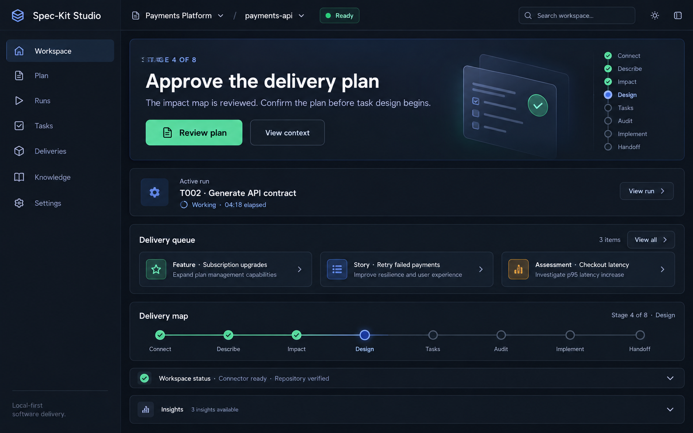

# Workspace Dashboard UX Plan

## Purpose

Build a calm, high-confidence **Workspace Hub** that helps a person answer three questions immediately:

1. What needs my attention now?
2. What is already safe, connected, or complete?
3. Where do I go for the next meaningful action?

The dashboard is not a reporting wall, a duplicate Feature Journey, or a generic project homepage. It is the navigation and decision layer above the existing workspace, feature, story, agent, and review surfaces. Its job is to reduce searching, prevent incorrect actions, and make Studio feel trustworthy even when a project has many artifacts and stages.

The design principle is **one primary action, clear status, optional depth**. Users should never need to interpret multiple conflicting “next” cards, figure out whether an agent is running, or search unrelated screens for a feature’s worktree, evidence, or approval state.

## Visual concept

The following concept screenshot illustrates the intended hierarchy: a compact workspace command bar, one dominant next-step card, conditional active-run context, a short delivery queue, a thin stage map, and collapsed supporting status. It is a design reference, not a representation of an implemented screen.



## Existing foundation and design constraints

Studio already has the domain pieces needed for a strong dashboard:

- `FeatureJourney` is the authoritative ordered stage flow and human-approval boundary.
- `WorkspaceControlCenter` owns local connector, repository, Spec-Kit, and baseline setup.
- `FeatureInbox`, delivery plans, implementation receipts, and the feature registry provide scoped delivery state.
- `PromptStudio` owns one-task-at-a-time implementation and its retained evidence.
- `AuditDashboard`, `TaskBoard`, `PlanEditor`, and `SpecEditor` are destination workspaces, not dashboard replacements.
- `workflowContext.ts` already resolves independent workflows such as bug fixes or assessments.
- `ProgressiveDisclosure`, `AgentJobStatus`, `ActionErrorNotice`, `Badge`, and semantic `--theme-*` variables are reusable UI foundations.

The current `overview` route renders `FeatureJourney`. An older `OverviewDashboard` component exists, but it is not the active landing surface. The new design must not reintroduce a second, competing workflow dashboard. Instead, it should become the composition layer used by the Workspace Hub and link into the Journey’s authoritative action.

## Product model

### The dashboard has three levels

| Level | User question | Scope | Examples |
| --- | --- | --- | --- |
| Workspace | “Is this workspace ready and healthy?” | Repository, connector, local agent, baseline | Connector connected, repository selected, Spec-Kit compatible |
| Delivery | “Which outcome needs me next?” | Current feature, story, bug, or assessment | Review story, create worktree, approve plan |
| Evidence | “What changed and what must I review?” | Selected delivery item and latest agent job | Agent running, files changed, approval available |

The screen begins with workspace and delivery summary, then reveals evidence only when it is relevant. It never makes a user read all three levels at once.

### Information hierarchy

At most one region may be visually dominant:

1. **Blocking recovery** — connector unavailable, job failed, worktree conflict, or required human decision.
2. **Active local run** — a currently running connector job, with elapsed time, what is being done, and one safe action: view progress or stop safely.
3. **Your next step** — the authoritative Journey or workflow action.
4. **Ready work** — imported features or stories that are not currently active.
5. **Healthy context** — connector/repository status and lightweight progress.
6. **History and analytics** — collapsed by default.

This priority order is deterministic. A green completion message must not displace an error; a feature card must not displace an active local run; a generic “start work” button must not compete with the Journey’s actual next action.

## When the dashboard appears

### Primary entry points

The Workspace Hub should appear when a user:

- opens a workspace from the workspace switcher;
- chooses **Workspace Hub** in the header or navigation;
- creates a new workspace;
- finishes an import, extraction, or repository scan;
- returns from a completed stage, task receipt, audit review, or local-agent run;
- follows a deep link to a workspace without a more specific destination.

### It should not forcibly interrupt focused work

Do **not** redirect a person from Spec, Plan, Tasks, Prompt Studio, Audit, or a running job to the dashboard. A dashboard is a home and recovery surface, not a modal interruption. Instead:

- show a compact persistent “run in progress” indicator in the header while the user is elsewhere;
- allow it to open the active-run detail on the dashboard or the relevant stage;
- return to the dashboard only after a user explicitly chooses “Back to Workspace Hub” or completes an action whose natural destination is the next decision.

### Context-dependent first state

| Workspace state | Dominant dashboard region | Primary action |
| --- | --- | --- |
| No repository connected | Setup readiness | Connect a repository |
| Connector missing or incompatible | Local setup status | Install/start/update connector |
| Repository connected, no active delivery item | Delivery queue | Start delivery work |
| Imported feature or story, stage ready | Your next step | Open that stage |
| Agent job running | Active run | View live progress |
| Agent stopped/failed | Recovery action | Review issue and retry safely |
| Reviewable evidence available | Decision card | Review and approve / record receipt |
| Journey complete | Outcome summary | View handoff package or start another delivery item |
| Independent workflow active | Workflow-specific next step | Continue the active workflow |

## Proposed screen anatomy

### 1. Workspace command bar

A compact, persistent top region—not a large hero card.

It contains:

- workspace name and repository name;
- current delivery item title when one is active;
- connector status as one semantic chip: **Ready**, **Needs setup**, **Updating**, **Offline**, or **Run active**;
- one global search/command entry point;
- an overflow menu for export, settings, and advanced diagnostics.

It must not show raw paths, verbose agent versions, or all technology findings. Those belong behind “Connection details” or “Workspace details.”

### 2. Your next step (always first)

This is the central decision card. It is driven from the same pure readiness rules as `FeatureJourney`, never recreated with separate conditions.

Required content:

- numbered stage or workflow step;
- concise action name: “Review this story,” “Create isolated worktree,” “Approve the delivery plan,” or “Run T002 with Codex”;
- one sentence explaining why it matters;
- the single primary action;
- only blockers necessary to act now;
- a secondary “View context” disclosure.

The card must never offer “Start delivery work” when an existing active feature has a more precise next stage. It must never claim that an agent will automatically approve or advance work.

### 3. Active run or review result (conditional, above the queue)

If a local agent is running, replace supplementary panels with an **Active run** strip/card:

- agent-neutral label from the connector adapter;
- task or stage identifier;
- current phase: starting, working, waiting for review, stopped, or complete;
- elapsed time and a transparent expectation range;
- a live progress indicator that does not rely on color alone;
- “Open run details” and “Stop safely” actions.

If the job is terminal, show a compact result card instead:

- success: “Review evidence before continuing”; 
- failure: plain-language diagnosis plus the one recommended recovery action;
- no large raw log by default; diagnostics remain expandable and redacted.

### 4. Delivery queue

Show the active item plus a short list of available work. The default is a maximum of three visible items, ordered by:

1. active item;
2. item requiring human review;
3. next ready item;
4. newest imported item.

Each item contains type, title, one-line outcome, stage/status, and one explicit action. Counts and tags remain secondary. A “View all delivery items” disclosure opens the fuller registry.

The queue must distinguish clearly between:

- a feature;
- an independently deliverable user story;
- a shared workspace task board;
- a process case such as a bug or assessment.

These are related but must not be merged into one misleading number.

### 5. Delivery map

Use a thin, accessible stage timeline only for the active item. It communicates progress and permits navigation to completed evidence, but it is not a second action panel.

- completed stages: reviewable links;
- active stage: highlighted with status text;
- future stages: visibly locked but not disabled without explanation;
- at small sizes: render as a compact “Stage 4 of 8” link rather than eight squeezed labels.

### 6. Workspace readiness

Show as a collapsed “Workspace status” row when healthy; expand only for problems or when requested.

Status checks:

- local connector reachable and version-compatible;
- connector pairing state without exposing a secret;
- active repository and allowed path confirmation;
- local agent availability by capability, not vendor assumption;
- Spec-Kit availability/version when required by the selected workflow;
- baseline status.

Use action-oriented language: “Connector ready” rather than “127.0.0.1:4318 healthy.” The local URL, raw version, and diagnostics belong in the disclosure.

### 7. Optional insight modules

These should never appear above the next action:

- requirement coverage and traceability;
- feature registry / worktree map;
- audit trends;
- recent reviewed evidence;
- workspace activity history;
- setup shortcuts and advanced tools.

Default: collapsed. Persist each user’s expansion preference per workspace, while always expanding a module that contains an actionable error.

## Interaction rules

### Navigation contract

Every dashboard link must target a single existing Studio tab or a typed detail route. The dashboard should pass intent, not reproduce screen state.

Examples:

| Dashboard action | Destination | Passed intent |
| --- | --- | --- |
| Review user story | Feature Journey | active feature + stage 2 |
| Open active run | Prompt Studio or Journey | task/stage job reference |
| Inspect feature plan | Plan workspace | active feature + accepted plan |
| Implement next task | Prompt Studio | selected task ID |
| Fix connector | Workspace Control Center | open connection/setup disclosure |
| Review audit | Audit Dashboard | active feature |
| View delivery queue | Feature registry | selected feature |

### Empty states are guided starts

An empty workspace should not show a dashboard full of zero-value cards. It shows one start path:

1. connect repository;
2. verify local connector only if needed for the selected route;
3. start/import a feature or story.

The user can reveal advanced import modes, manual artifact recovery, and external integrations when needed.

### Errors are local and recoverable

- Show the error beside the affected action.
- State what was not changed or not assumed.
- Offer one safe recovery action first.
- Keep raw diagnostics collapsed and redacted.
- Never replace an active delivery item with a generic error page.

### Accessibility and inclusive usability

- Meet WCAG 2.2 AA contrast for all themes; semantic tokens only, never color-name utility classes for meaning.
- Use text plus icon plus status wording for success, warning, and error.
- Keep keyboard focus on the action that caused a state update; announce run and approval transitions through polite live regions.
- Make stage map, queue, and status chips reachable and understandable with a screen reader.
- Respect `prefers-reduced-motion`; no pulsing status indicator is the only sign of activity.
- Support narrow screens with a single vertical flow: next action, active run/result, queue, then optional details.
- Avoid time pressure. Elapsed time must never imply failure without an actual connector result.

## Component architecture

The dashboard should be composed from small, testable, presentational regions and pure view-model functions.

### New modules

```text
src/components/dashboard/workspaceHub/
  WorkspaceHub.tsx                 # layout/orchestration only
  WorkspaceCommandBar.tsx
  NextActionCard.tsx
  ActiveRunCard.tsx
  DeliveryQueue.tsx
  DeliveryQueueItem.tsx
  ActiveDeliveryMap.tsx
  WorkspaceReadinessRow.tsx
  InsightDisclosure.tsx
  EmptyWorkspaceStart.tsx
  dashboardTypes.ts

src/lib/dashboard/
  dashboardViewModel.ts            # pure ordered dashboard state
  dashboardPriority.ts             # deterministic dominant-region rules
  dashboardNavigation.ts           # typed destinations and intent
  dashboardPreferences.ts          # disclosure preferences only
```

### Reuse rather than rebuild

| Need | Reuse / extend |
| --- | --- |
| Stage definition and readiness | `lib/featureJourney.ts` |
| Workflow-specific next action | `lib/workflowContext.ts` |
| Active feature selection | `activeFeatureForProject` |
| Agent run display | `AgentJobStatus`, with a compact variant |
| Expansion behavior | `ProgressiveDisclosure` |
| Error treatment | `ActionErrorNotice` and `agentDiagnostics` |
| Connector state | typed `lib/connector.ts` client and release/version helpers |
| Semantic visual roles | `ThemeContext` and `--theme-*` tokens |
| Feature/task progress | `featureDeliveryTasks` and reviewed receipts |

Do not import React state or local storage directly into pure dashboard classifiers. `dashboardViewModel.ts` accepts a project snapshot, connector snapshot, and optional job snapshot and returns a typed model. This makes priority behavior unit-testable and prevents a dashboard from drifting away from the actual Journey rules.

### Example view-model shape

```ts
type DashboardViewModel = {
  dominant: 'blocker' | 'active-run' | 'next-action' | 'completion' | 'onboarding';
  nextAction?: { title: string; description: string; destination: DashboardDestination; blocker?: DashboardBlocker };
  activeRun?: { owner: 'journey' | 'task'; status: 'running' | 'review' | 'failed'; label: string; elapsedMs?: number };
  activeDelivery?: DeliverySummary;
  queue: DeliverySummary[];
  readiness: ReadinessSummary[];
  insights: InsightSummary[];
};
```

## Data, performance, and resilience

- Render from the persisted workspace snapshot immediately; do not block the entire screen on a connector health request.
- Refresh connector health and active job state in the background only while the dashboard is visible or a job is active.
- Use bounded polling with exponential backoff after network errors. Preserve the last known status and label it as stale rather than silently resetting it.
- Never query full repository artifacts merely to show the dashboard. Load artifact bodies after a user opens a detail panel.
- Persist only UI preferences such as disclosure state; retain authoritative delivery state in the existing workspace model and scoped receipts.
- Use stable empty/error states when the connector is offline. The dashboard still links to retained artifacts and explains that live status is unavailable.

## Measurement and quality bar

Instrument privacy-safe, product-level events without retaining source code, prompts, tokens, paths, or agent output:

- dashboard opened;
- primary action shown and selected;
- action destination opened;
- connector setup help opened;
- active run resumed after navigation;
- recovery action opened;
- optional disclosure expanded.

Success measures:

- ≥90% of users reach the correct next workspace from the dashboard without backtracking.
- ≥95% of active runs are recognized as running after navigation or refresh.
- No dashboard state offers an action contradicting Journey readiness.
- No normal dashboard viewport presents more than one primary call-to-action.
- Keyboard-only and screen-reader journeys complete the same next action.

## Delivery plan

### Phase 0 — Foundation and behavior contract

1. Define `DashboardViewModel`, destination types, and dominant-priority rules.
2. Add unit tests for every state in the “when it appears” table.
3. Add a single navigation intent contract to `WorkspaceView`.
4. Audit the current `OverviewDashboard`; reuse its metrics subcomponents only where they are not duplicate workflow context.

**Exit criteria:** the pure model returns exactly one primary action and correct destination for onboarding, active feature, active run, failure, review-ready, and complete states.

### Phase 1 — Calm Workspace Hub

1. Add `WorkspaceHub` as the Workspace Hub route surface.
2. Implement command bar, next-action card, active delivery summary, and connector readiness row.
3. Preserve Feature Journey as the authoritative destination; do not embed its full body in the hub.
4. Introduce semantic component classes and token-only styling.

**Exit criteria:** a user can understand workspace status and reach the next action in one screen without seeing duplicate cards.

### Phase 2 — Delivery queue and live work

1. Add queue sorting and clear type labels for feature, story, and independent workflow.
2. Add compact active-run and review-result variants using the existing connector job recovery mechanism.
3. Add typed navigation to Prompt Studio, Journey, Plan, Audit, and Workspace Control Center.

**Exit criteria:** an active run remains discoverable after navigation, refresh, or return to the hub; no task is presented as “in progress” without a running job reference.

### Phase 3 — Progressive insight and personalization

1. Add optional traceability, registry, audit, and history insights.
2. Persist disclosure preferences per workspace.
3. Add responsive, keyboard, screen-reader, and reduced-motion verification.
4. Add observability for navigation success and accidental backtracking.

**Exit criteria:** optional information never competes with the primary action, and all themes pass contrast review.

### Phase 4 — Validation and rollout

1. Add component tests, view-model tests, and end-to-end journeys for all dominant states.
2. Run a structured UX review with new and experienced users.
3. Compare navigation completion, recovery success, and time-to-next-action against the current screen.
4. Roll out behind a local preference or feature flag first; retain a reversible path during validation.

## Explicit non-goals

- Replacing the Feature Journey, Prompt Studio, or Workspace Control Center.
- Adding automatic approvals, commits, pushes, or agent execution.
- Creating a SaaS-style analytics dashboard filled with vanity metrics.
- Showing all feature plans, artifacts, raw logs, and repositories by default.
- Assuming Codex, Claude, Copilot, Gemini, or any particular agent is installed.
- Making a remote deployment depend on direct browser access to a local filesystem.

## Recommended first implementation slice

Start with the Workspace Hub **without changing workflow behavior**:

1. Build the pure dashboard view model and tests.
2. Render only: connector status, active delivery title, one next-action card, active-run/review-result card, and a three-item delivery queue.
3. Reuse current destination screens via typed navigation callbacks.
4. Move existing duplicated overview metrics behind a single “Workspace details” disclosure.

This yields a visible UX improvement quickly, preserves current safety guarantees, and gives the team a stable component architecture for the richer dashboard rather than another large, tightly coupled screen.
